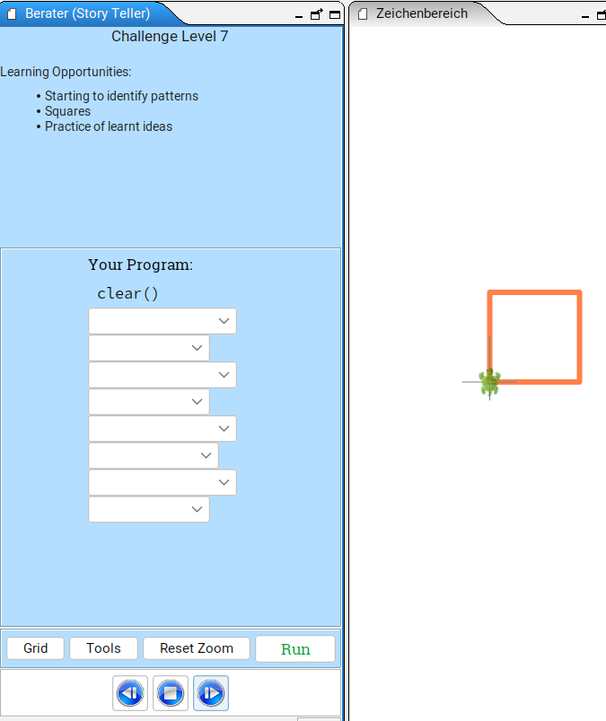
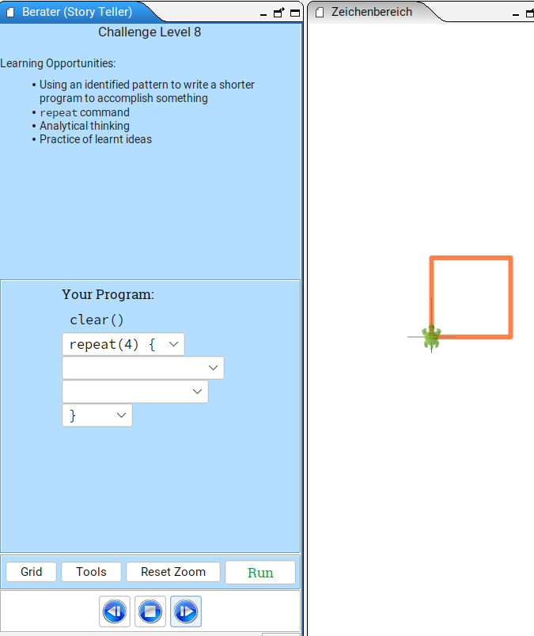
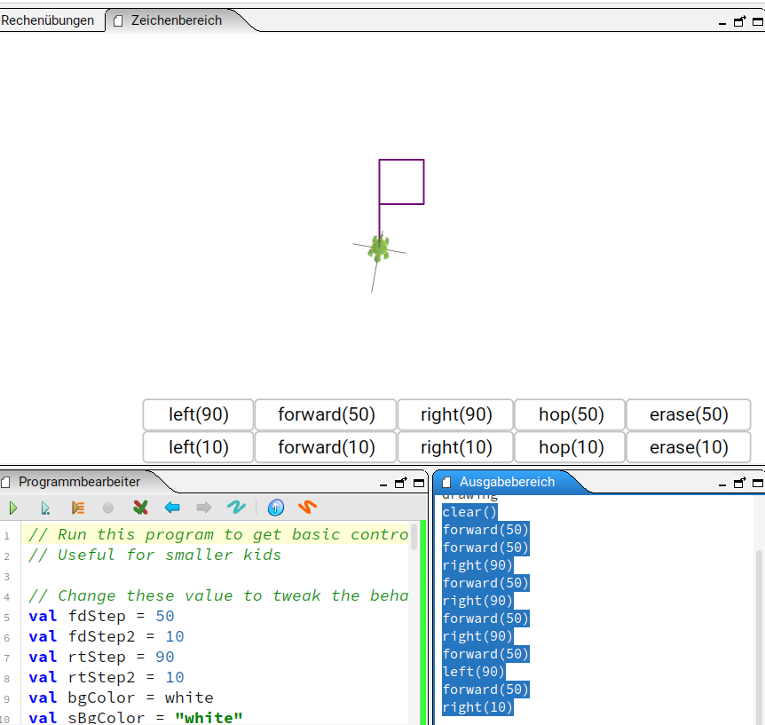
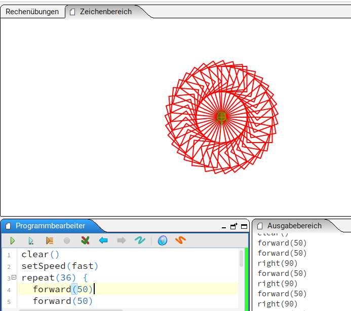
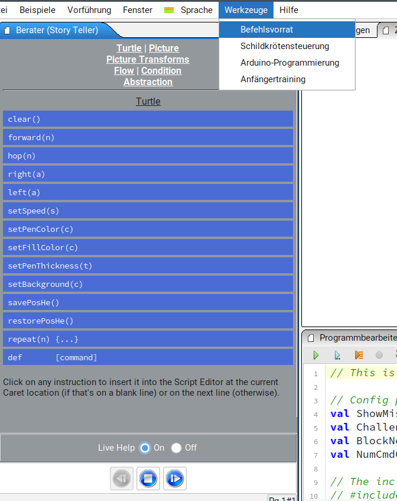
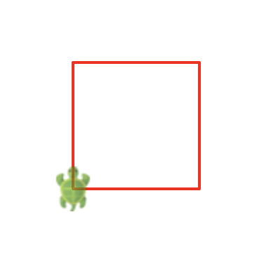
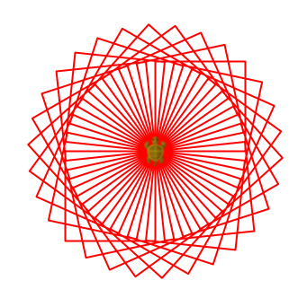

# Programmieren mit Kojo

## Aufgaben

### Aufgabe 1

- Starte das Anfängertraining (Menü Tools->Beginner Challenges).
- Löse Level 1
- Löse Level 7 und 8: das Quadrat mit und ohne `repeat(4) { ... }`.

### Aufgabe 2

- Starte die Schildkrötensteuerung (Menü Tools->Turtle Controller).
- Male eine Figur, bei der die Schildkröte am Start wieder ankommt, aber leicht verdreht ist (z.B. 10 Grad verdreht).
- Kopiere den Code vom Ausgabefenster(Output Pane) in den Programmierbearbeiter(Script Editor)  
  (Click Output Pane, Ctrl-A, Ctrl-C, Click Script Editor, Ctrl-A, Ctrl-V).
- Wiederhole den Code (ohne `clear()`) so oft, dass eine Drehfigur entsteht (z.B. `repeat(36) { ... }`).
- Programm kann beliebig oft gestartet werden mit dem grünen Pfeil im Script Editor.
- Wenn Dir die Schildkröte zu langsam ist, kannst Du zu Aufgabe 3 springen und danach nochmal schönere Drehfiguren 
produzieren.

### Aufgabe 3

- Starte die Dokumentation des Befehlsvorrats (Tools->Instruction Palette).

- Wähle "Live help: On".
- Halte den Mauszeiger über den Turtle Befehl `setSpeed(s)`.
- Füge den Befehl `setSpeed(...)` in Dein Programm aus Aufgabe 2 ein, um die Geschwindigkeit der Schildkröte zu 
verändern. In der Dokumentation werden mögliche Werte genannt: "Possible values are ...". 
Probiere verschiedene Werte aus, um die Auswirkungen zu beobachten.

### Aufgabe 4

Zeichne Dein eigenes Quadrat mit Hilfe des Befehlsvorrats. Verwende dabei den `forward`-Befehl nur einmal. 

Tipps: 
- Verwende Wiederholung/repeat
- Ganz oben im Befehlsvorrat gibt es "Flow"
- Dort gibt es Hilfe zum Befehl `repeat [command]`

### Aufgabe 5

- Zeichne Deine eigene Drehfigur mit Hilfe des Quadrats aus Aufgabe 4 (z.B. durch `repeat` innerhalb `repeat(n) {...}`). 
- Spiele mit `setPenColor` und `setPenThickness`, um die Figur abwechslungsreich zu gestalten.
- Versuche auch folgende Figur zu zeichnen.

Tipps:
- Die Wiederholungszahl mal der leichten Drehung sollte 360 Grad ergeben (z.B. `repeat(30) { ... right(12) }`)