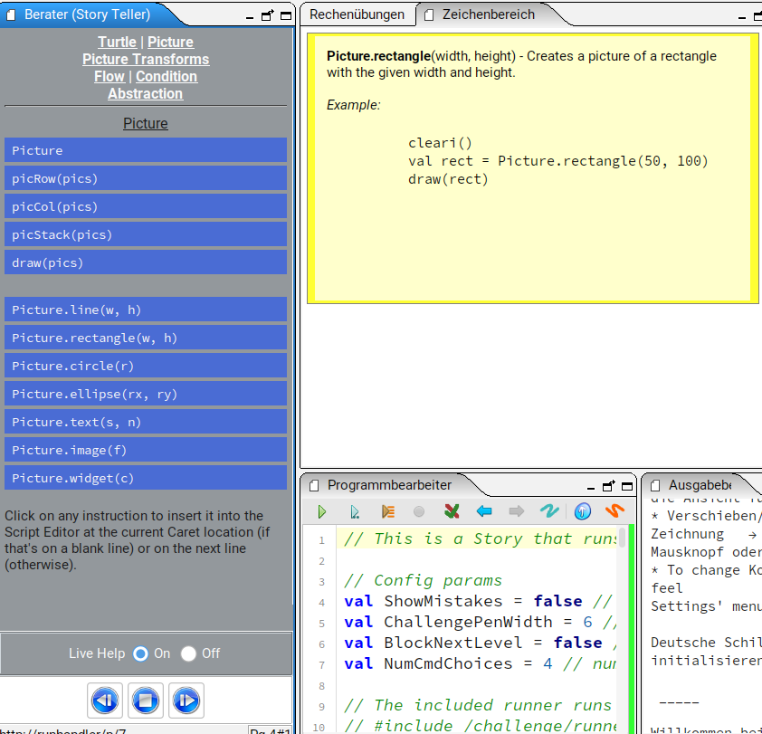

# Schildkrötenbefehle

## Startpunkt ist Aufgabe 3 aus letztem Arbeitsblatt

- Starte die Dokumentation des Befehlsvorats (Menü Tools->Instruction Palette)
- Wähle "Live help: On"
- Suche und teste Schildkrötenbefehle (z.B. `setSpeed(fast)`, `setFillColor(red)`)


### Teste Befehl setSpeed

```scala
clear()
setSpeed(fast)
repeat(36) {
  repeat(4) {
    forward(100)
    left(90)
  }
  right(10)
}
```

### Teste Farben

```scala
clear()
setBackgroundH(yellow,blue)
setPenColor(red)
setFillColor(green)
setPenThickness(3)
repeat(3) {
  forward(100)
  right(120)
}
```

### Verändere Schildkröte

```scala
clear()
setSpeed(slow)
repeat(4) {
  setCostume(Costume.bat1)
  forward(50)
  setCostume(Costume.bat2)
  forward(50)
  right(90)
}
```

## Fortgeschrittene Themen

### Funktionen

```scala
def mein_haus() {
  savePosHe()
  repeat(5) {
    left(90)
    forward(100)
  }
  left(45)
  forward(71)
  left(90)
  forward(71)
  restorePosHe()
}

clear()
setSpeed(medium)
right(90)
repeat(3) {
  mein_haus()
  hop(200)
}
```

### Mehrere Schildkröten

```scala
def blume(t:Turtle, c:Color) = runInBackground {
  t.setSpeed(slow)
  t.setPenColor(black)
  t.setFillColor(c)
  repeat(4){
    t.right()
    repeat(90){
      t.turn(-2)
      t.forward(2)
    }
  }
  t.invisible()
}

cleari()
val schildkroete1=newTurtle(-200,100)
val schildkroete2=newTurtle(100,100)
blume(schildkroete1, green)
blume(schildkroete2, yellow)
```

# Zeichenbefehle

## Startpunkt ist Aufgabe 4 aus letztem Arbeitsblatt

- Starte die Dokumentation des Befehlsvorats (Menü Tools->Instruction Palette)
- Wähle "Live help: On"
- Wähle ganz oben: "Picture" oder "Picture Transforms"
- Suche und teste Picture Befehle (z.B. `Picture.rectangle(50,100)`)
- Teste den Unterschied von `clear()` und `cleari()`



### Teste Befehl Picture.rectangle

```scala
cleari()
val rect = Picture.rectangle(50, 100)
draw(rect)
draw(Picture.text("Klasse 5", Font("Serif", 30)))
```

### Teste Verzerrung und Rotation

- Links von `->` steht die Veränderung
- Mehrere Veränderungen sind durch `*` getrennt
- Zwischenständen kann man mit `val` Namen geben

```scala
cleari()
val rechteck = Picture.rectangle(50, 50)
val vollesRechteck =
  fillColor(lightGray) -> rechteck
draw(scale(2,1) * rotp(45,0,0) -> vollesRechteck)
```

### Verschiebe Objekte an ihre Position

```scala
cleari()
val koerper = Picture.rectangle(10, 50)
draw(koerper)
val kopf = Picture.circle(10)
draw(trans(5,60) -> kopf)
val linker_arm = Picture.line(40, 30)
draw(trans(10,30) -> linker_arm)
val rechter_arm = Picture.line(-40, 30)
draw(trans(0,30) -> rechter_arm)
val bein = picCol(
  Picture.ellipse(15, 5),
  trans(10,0)->Picture.ellipse(5, 15)
)
draw(trans(-15,-30) -> bein)
draw(flipY * trans(-25,-30) -> bein)
```

## Fortgeschrittene Themen

### Schleifen

```scala
cleari()
val karte =
  fillColor(green) -> Picture.rectangle(50, 80)
for (i <- 1 to 4) {
  for (j <- 1 to 2) {
    draw(trans(i*70 - 200,j*100 - 100) -> karte)
  }
}
```

### Animation

```scala
val auto=Picture.image("/media/car-ride/car1.png")
cleari()
draw(auto)
activateCanvas()
animate {
  if (isKeyPressed(Kc.VK_LEFT)) {
    val pVel = Vector2D(-3, 0)
    auto.translate(pVel)
  }
  if (isKeyPressed(Kc.VK_RIGHT)) {
    val pVel = Vector2D(3, 0)
    auto.translate(pVel)
  }
}
```

### Mausclick auf Objekt

```scala
def zeige_nummer(
  x: Double, y: Double,
  mouse_x: Double, mouse_y: Double) {
  draw(trans(x+20, y+60)
    -> Picture.text("1", Font("Serif", 30)))
  draw(trans(mouse_x, mouse_y)
    -> Picture.ellipse(3,3))
}

cleari()
val karte
  = fillColor(green) -> Picture.rectangle(50, 80)
for (i <- 1 to 4) {
  for (j <- 1 to 2) {
    val x = i*70 - 200
    val y = j*100 - 100
    val verschobene_karte = trans(x,y) -> karte
    verschobene_karte.onMouseClick(
      (mouse_x, mouse_y)
      => zeige_nummer(x, y, mouse_x, mouse_y)
    )
    draw(verschobene_karte)
  }
}
```
