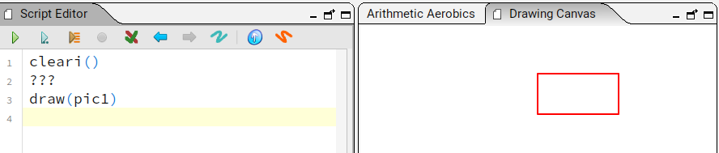
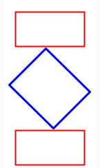
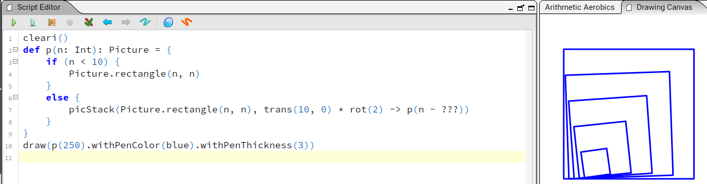

# Kojo Aufgabenblatt 3: Picture Graphics

In diesem Aufgabenblatt arbeitet ihr mit der Kojo-Dokumentation zu [**Picture Graphics**](https://docs.kogics.net/).


- Klick auf "Picture Graphics"
- Klick auf "An introduction to Pictures"
- Dies sollte Dich zu 
[Kojo Doku: introduction to Pictures](https://docs.kogics.net/tutorials/pictures-intro.html#picture-creation)
führen
- Nutze die Dokumentation um folgende Aufgaben zu lösen

---

## Aufgabe 1: Rechteck

- Ersetze `???` in folgendem Code so, dass ein Rechteck mit 100 x 50 Pixeln gezeichnet wird:

```scala
cleari()
???
draw(pic1)
```



- Teste den Unterschied von `clear()` zu `cleari()`

---

## Aufgabe 2: Drei Rechtecke zeichnen

Erstelle folgende Figur aus drei Rechtecken mit unterschiedlichen Größen, Farben, Drehung und Position:

So soll es ungefähr aussehen:



---

## Bonusaufgabe: Diese Aufgabe kann auch gelöst werden ohne jede Zeile zu verstehen

- Ersetze `???` in folgendem Programm so, dass das gezeigte Bild entsteht:

```scala
cleari()
def funktion_mit_parameter(n: Int): Picture = {
    if (n < 10) {
        Picture.rectangle(n, n)
    }
    else {
        picStack(Picture.rectangle(n, n), trans(10, 0) * rot(2) -> funktion_mit_parameter(n - ???))
    }
}
draw(funktion_mit_parameter(250).withPenColor(blue).withPenThickness(3))
```



Tipps:

- Dieses Programm findet ihr in der Dokumentation allerdings mit einem anderen Wert bei ???.
- Die Funktion `funktion_mit_parameter` hat einen Parameter `n`.
- `n` steht für eine beliebige Pixelanzahl, welche die Kantenlänge der Quadrate angibt: `Picture.rectangle(n, n)`
- `funktion_mit_parameter(250)` zeichnet also mindestens ein Quadrat der Seitenlänge 250.
- Es zeichnet außerdem weitere Quadrate weil es sich selbst aufruft: `funktion_mit_parameter(n - ???)`
- Die Seitenlänge des nächsten gezeichneten Quadrats ist daher um den Wert ??? geringer als `n`.
- Es werden keine weiteren Quadrate mehr gezeichnet wenn `n < 10` ist.
- In unserem Fall wird als sechstes ein Quadrat mit `n=0` gezeichnet. Das sieht man nur nicht.