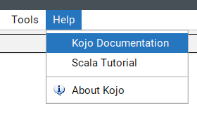
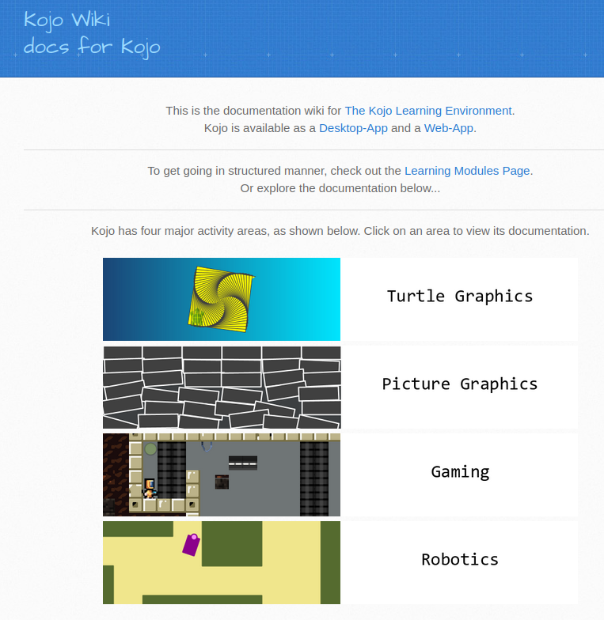
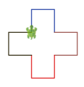
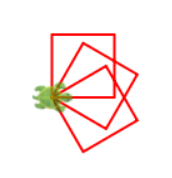

# Dokumentation nutzen und neue Herausforderungen finden

Die Kojo-Dokumentation hilft dir, neue Befehle zu verstehen und eigene Ideen zu bauen.
Ausserdem findest du dort viele neue Herausforderungen.

## Start: Getting Started Buch öffnen

Folgendermaßen kannst Du die Dokumentation von Kojo öffnen:

Visit the **Kojo Docs** site

Folgende Aufgaben beziehen sich auf das Kojo-Buch zu dem man auch über 
Turtle Graphics -> Getting Started -> Getting Started kommt:

- [Getting Started (PDF)](https://github.com/litan/kojo/releases/download/2.9.05_release/getting-started-06-08-18.pdf)

## Aufgabe 1: Farbiges Kreuz (Seite 7)

Suche im Getting-Started-Buch auf **Seite 7** die Herausforderung mit dem bunten Kreuz und wähle die richtigen Befehle 
anstatt der drei Fragezeichen "???".
Vergleiche mit diesem Bild:

Wenn du die Stelle gefunden hast, probiere die Aufgabe in Kojo aus.

## Aufgabe 2: Drei Quadrate mit eigener Funktion (Seite 14)

Suche im Buch auf **Seite 14** die Aufgabe, in der eine eigene Funktion `square()` verwendet wird und löse sie.
Zeichne damit **drei Quadrate**.

Wichtig:

- Mit dem Schlüsselwort `def` wird eine Funktion definiert.
- `def square()` definiert eine Funktion, die man danach mit `square()` aufrufen kann
- Die Anweisungen, die beim Funktionsaufruf ausgefuehrt werden, stehen in geschweiften Klammern `{ ... }`.

Beispielbild:

## Fortgeschrittene Aufgabe (Seite 15)

Wenn du fertig bist, gehe auf **Seite 15** und probiere die naechste Herausforderung:

