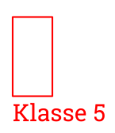
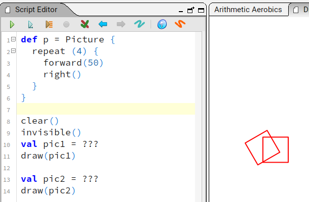
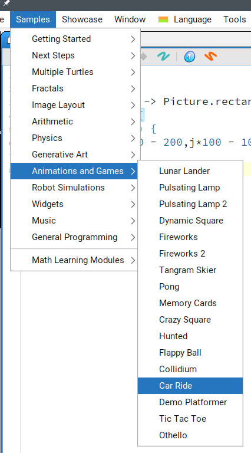
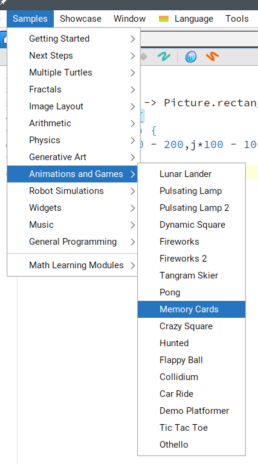

# Schildkrötenbefehle

## Wiederholung des Befehlsvorrats

1. Starte die Dokumentation des Befehlsvorrats (Menü Tools->Instruction Palette)
2. Wähle "Live help: On"


3. Halte den Mauszeiger über `setSpeed(s)` und experimentiere mit verschiedenen 
Geschwindigkeiten, welche die Dokumentation nennt: "Possible values are ..."

```scala
clear()
setSpeed(fast)
repeat(36) {
  repeat(4) {
    forward(100)
    left(90)
  }
  right(10)
}
```

4. Halte den Mauszeiger über `setFillColor(c)` und führe das Beispielprogramm aus:


5. Halte den Mauszeiger über `setFillColor(c)`, `setPenColor(c)` und `setPenThickness(t)`.
Versuche vorherzusagen was folgendes Programm zeichnen wird und teste es danach aus:

```scala
clear()
setBackgroundH(yellow,blue)
setPenColor(red)
setFillColor(green)
setPenThickness(3)
repeat(3) {
  forward(100)
  right(120)
}
```

6. Schau Dir folgendes Programm an. Beobachte, wie die Befehle hinter `def main_haus(){` immer nur dann
ausgeführt werden wenn weiter unten `mein_haus()` aufgerufen wird.

```scala
def mein_haus() {
  savePosHe()
  repeat(5) {
    left(90)
    forward(100)
  }
  left(45)
  forward(71)
  left(90)
  forward(71)
  restorePosHe()
}

clear()
setSpeed(medium)
right(90)
repeat(3) {
  mein_haus()
  hop(200)
}
```

7. Zeichne durch möglichst kleine Änderungen Häuser an anderen Positionen:


## Beispielprogramme

Kojo hat viele Beispielprogramme. Das ist toll um Ideen zu bekommen was man programmieren könnte.
Allerdings ist der Programmcode oft sehr lange und kompliziert. 
Im Folgenden sind kurze Programmstücke aus den Bespielen geholt, die ihr verstehen könnt:

### Turtle Beispiel 1: Veränderte Schildkröte


```scala
clear()
setSpeed(slow)
repeat(4) {
  setCostume(Costume.bat1)
  forward(50)
  setCostume(Costume.bat2)
  forward(50)
  right(90)
}
```

### Turtle Beispiel 2: Mehrere Schildkröten


```scala
def blume(t:Turtle, c:Color) = runInBackground {
  t.setSpeed(slow)
  t.setPenColor(black)
  t.setFillColor(c)
  repeat(4){
    t.right()
    repeat(90){
      t.turn(-2)
      t.forward(2)
    }
  }
  t.invisible()
}

cleari()
val schildkroete1=newTurtle(-200,100)
val schildkroete2=newTurtle(100,100)
blume(schildkroete1, green)
blume(schildkroete2, yellow)
```

# Zeichenbefehle

## Wiederholung des Befehlsvorrats

1. Starte die Dokumentation des Befehlsvorrats (Menü Tools->Instruction Palette)
2. Wähle "Live help: On"
3. Wähle ganz oben: "Picture"


4. Halte den Mauszeiger über `Picture.rectangle(w, h)` und `Picture.text(w, h)`.
Kombiniere die zwei Beispielprogramme mit dem Text "Klasse 5" in Schriftgröße 30 zu:



5. Wähle ganz oben: "Picture Transforms"

6. Halte den Mauszeiger über `trans(f)` und `rot(a)`.
Kombiniere die zwei Beispielprogramme zu: 



Tipp:
- in den Beispielen unterscheidet sich nur die vorletzte Zeile

7. Was die Instruction Palette nicht verrät: Man kann mit `scale(fx,fy)` ein Objekt auch verzerren (z.B. Raute)
und man kann mehrere Veränderungen mit `*` auf das gleiche Objekt anwenden:

```scala
cleari()
val rechteck = Picture.rectangle(50, 50)
val vollesRechteck =
  fillColor(lightGray) -> rechteck
draw(scale(2,1) * rot(45) -> vollesRechteck)
```

Tipp:
- Links von `->` steht die Veränderung
- Mehrere Veränderungen sind durch `*` getrennt
- Zwischenständen kann man mit `val` Namen geben


8. Der Fantasie beim Verändern von Kreisen, Linien und Rechtecken sind beim 
Zusammensetzen keine Grenzen gesetzt:

```scala
cleari()
val koerper = Picture.rectangle(10, 50)
draw(koerper)
val kopf = Picture.circle(10)
draw(trans(5,60) -> kopf)
val linker_arm = Picture.line(40, 30)
draw(trans(10,30) -> linker_arm)
val rechter_arm = Picture.line(-40, 30)
draw(trans(0,30) -> rechter_arm)
val bein = picCol(
  Picture.ellipse(15, 5),
  trans(10,0)->Picture.ellipse(5, 15)
)
draw(trans(-15,-30) -> bein)
draw(flipY * trans(-25,-30) -> bein)
```

9. Schleifen helfen ungemein viel um Tipparbeit zu sparen:

```scala
cleari()
val karte =
  fillColor(green) -> Picture.rectangle(50, 80)
for (i <- 1 to 4) {
  for (j <- 1 to 2) {
    draw(trans(i*70 - 200,j*100 - 100) -> karte)
  }
}
```

## Beispielprogramme

Kojo hat viele Beispielprogramme. Das ist toll um Ideen zu bekommen was man programmieren könnte.
Allerdings ist der Programmcode oft sehr lange und kompliziert. 
Im Folgenden sind kurze Programmstücke aus den Bespielen geholt, die ihr verstehen könnt:

### Picture Beispiel 1: Auto mit Tastatur steuern



```scala
val auto=Picture.image("/media/car-ride/car1.png")
cleari()
draw(auto)
activateCanvas()
animate {
  if (isKeyPressed(Kc.VK_LEFT)) {
    val pVel = Vector2D(-3, 0)
    auto.translate(pVel)
  }
  if (isKeyPressed(Kc.VK_RIGHT)) {
    val pVel = Vector2D(3, 0)
    auto.translate(pVel)
  }
}
```

### Picture Beispiel 2: Mausklick auf Karte als Vorbereitung für Memory



```scala
def zeige_nummer(
  x: Double, y: Double,
  mouse_x: Double, mouse_y: Double) {
  draw(trans(x+20, y+60)
    -> Picture.text("1", Font("Serif", 30)))
  draw(trans(mouse_x, mouse_y)
    -> Picture.ellipse(3,3))
}

cleari()
val karte
  = fillColor(green) -> Picture.rectangle(50, 80)
for (i <- 1 to 4) {
  for (j <- 1 to 2) {
    val x = i*70 - 200
    val y = j*100 - 100
    val verschobene_karte = trans(x,y) -> karte
    verschobene_karte.onMouseClick(
      (mouse_x, mouse_y)
      => zeige_nummer(x, y, mouse_x, mouse_y)
    )
    draw(verschobene_karte)
  }
}
```
