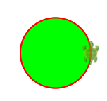
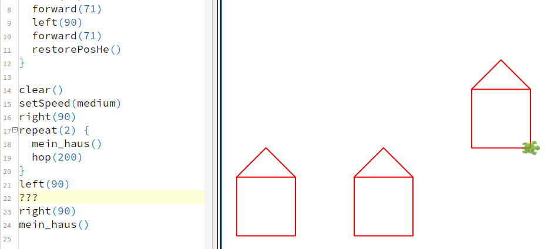
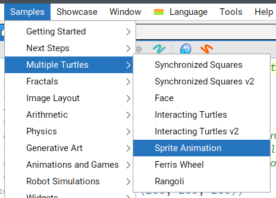
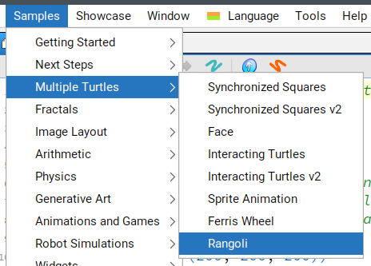

# Kojo Aufgabenblatt 4: Turtle-Welt

Wenn ihr weitermachen wollt, könnt ihr euch die **Turtle-Welt** aussuchen.

## Wiederholung des Befehlsvorrats

1. Starte die Dokumentation des Befehlsvorrats (Menü Tools->Instruction Palette)
2. Wähle "Live help: On"


3. Halte den Mauszeiger über `setSpeed(s)` und experimentiere mit verschiedenen
Geschwindigkeiten, welche die Dokumentation nennt: "Possible values are ..."

```scala
clear()
setSpeed(fast)
repeat(36) {
  repeat(4) {
    forward(100)
    left(90)
  }
  right(10)
}
```

4. Halte den Mauszeiger über `setFillColor(c)` und führe das Beispielprogramm aus:



5. Halte den Mauszeiger über `setFillColor(c)`, `setPenColor(c)` und `setPenThickness(t)`.
Versuche vorherzusagen, was folgendes Programm zeichnen wird, und teste es danach aus:

```scala
clear()
setBackgroundH(yellow,blue)
setPenColor(red)
setFillColor(green)
setPenThickness(3)
repeat(3) {
  forward(100)
  right(120)
}
```

6. Schau dir folgendes Programm an. Beobachte, wie die Befehle hinter `def mein_haus(){` immer nur dann
ausgeführt werden, wenn weiter unten `mein_haus()` aufgerufen wird.

```scala
def mein_haus() {
  savePosHe()
  repeat(5) {
    left(90)
    forward(100)
  }
  left(45)
  forward(71)
  left(90)
  forward(71)
  restorePosHe()
}

clear()
setSpeed(medium)
right(90)
repeat(3) {
  mein_haus()
  hop(200)
}
```

7. Zeichne durch möglichst kleine Änderungen Häuser an anderen Positionen:



## Beispielprogramme

Kojo hat viele Beispielprogramme. Das ist toll, um Ideen zu bekommen, was man programmieren könnte.
Allerdings ist der Programmcode oft sehr lang und kompliziert.
Im Folgenden sind kurze Programmstücke aus den Beispielen geholt, die ihr verstehen könnt:

### Turtle Beispiel 1: Veränderte Schildkröte



```scala
clear()
setSpeed(slow)
repeat(4) {
  setCostume(Costume.bat1)
  forward(50)
  setCostume(Costume.bat2)
  forward(50)
  right(90)
}
```

### Turtle Beispiel 2: Sind das mehrere Schildkröten oder ist das Kunst?



```scala
def blume(t:Turtle, c:Color) = runInBackground {
  t.setSpeed(slow)
  t.setPenColor(black)
  t.setFillColor(c)
  repeat(4){
    t.right()
    repeat(90){
      t.turn(-2)
      t.forward(2)
    }
  }
  t.invisible()
}

cleari()
val schildkroete1=newTurtle(-200,100)
val schildkroete2=newTurtle(100,100)
blume(schildkroete1, green)
blume(schildkroete2, yellow)
```
