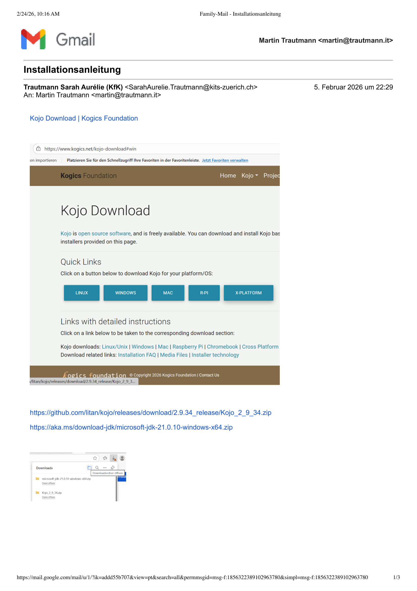
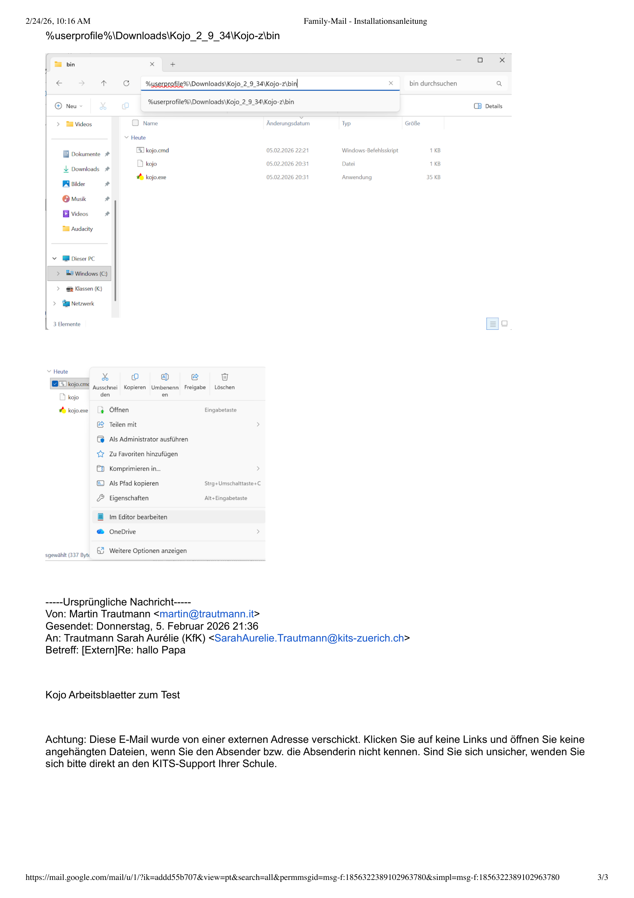

# 🐨 Kojo installieren auf Windows (ohne Admin-Rechte)

Hallo! 😊  
Hier lernst du Schritt für Schritt, wie du **Kojo** installierst.  
Du brauchst **keine Admin-Rechte**.

---

# 📥 Schritt 1: Kojo herunterladen

1. Öffne diesen Link:  
https://github.com/litan/kojo/releases/download/2.9.34_release/Kojo_2_9_34.zip

2. Die Datei wird in deinem **Downloads-Ordner** gespeichert.

So sieht die Seite aus:

---

# ☕ Schritt 2: Java herunterladen

Kojo braucht **Java**, damit es funktioniert.

1. Öffne diesen Link:  
https://aka.ms/download-jdk/microsoft-jdk-21.0.10-windows-x64.zip

2. Die Datei wird im **Downloads-Ordner** gespeichert.

---

# 📂 Schritt 3: ZIP-Dateien entpacken

1. Gehe in deinen **Downloads-Ordner**
2. Mache **Rechtsklick** auf die ZIP-Datei
3. Klicke auf **„Alle extrahieren…“**

So sieht das aus:

Mache das für:

- Kojo_2_9_34.zip  
- microsoft-jdk-21.0.10-windows-x64.zip  

---

# 📁 Schritt 4: Java-Ordner finden

Gehe jetzt in diesen Ordner:

Downloads  
→ microsoft-jdk-21.0.10-windows-x64  
→ jdk-21.0.10+7  
→ bin  

Der Pfad sieht so aus:

%USERPROFILE%\Downloads\microsoft-jdk-21.0.10-windows-x64\jdk-21.0.10+7\bin

---

# 🛠 Schritt 5: Kojo starten

Gehe jetzt in:

Downloads  
→ Kojo_2_9_34  
→ Kojo-z  
→ bin  

So sieht das aus:

Dort findest du:

- kojo.cmd  
- kojo.exe  

Doppelklicke auf:

kojo.exe  

Wenn alles richtig ist, startet Kojo! 🎉

---

# ❓ Wenn es nicht startet

Dann öffne die Datei **kojo.cmd** mit einem Editor.

Dort steht eine Zeile mit einem Java-Pfad.  
Der Pfad muss zu deinem Java-Ordner passen, zum Beispiel:

call %USERPROFILE%\Downloads\microsoft-jdk-21.0.10-windows-x64\jdk-21.0.10+7\bin\java

---

# ✅ Fertig!

Super! 🥳  
Jetzt kannst du mit Kojo programmieren.

Viel Spaß! 🚀
