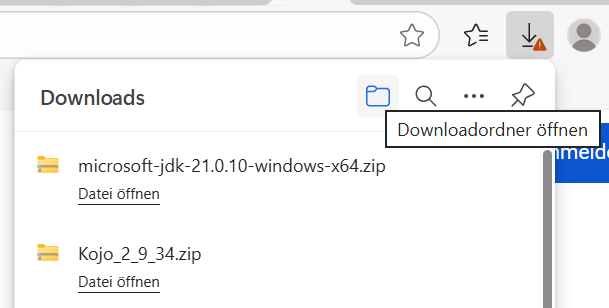
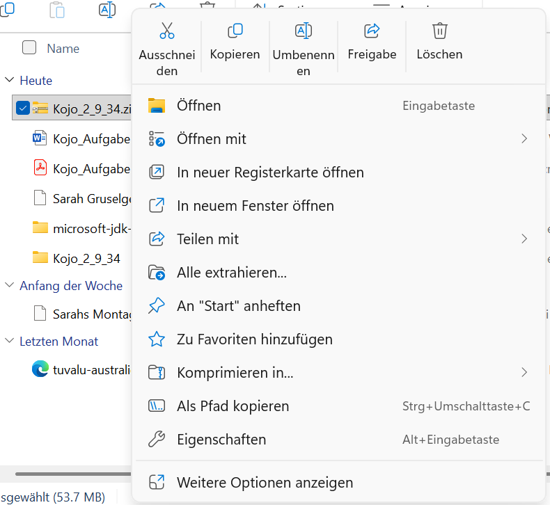
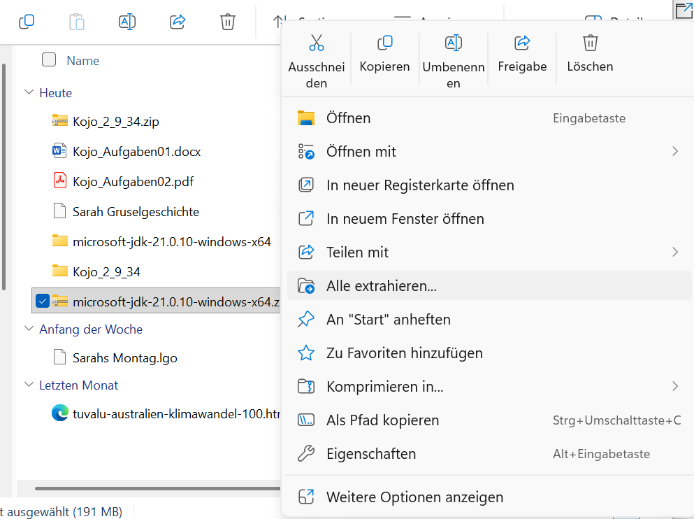
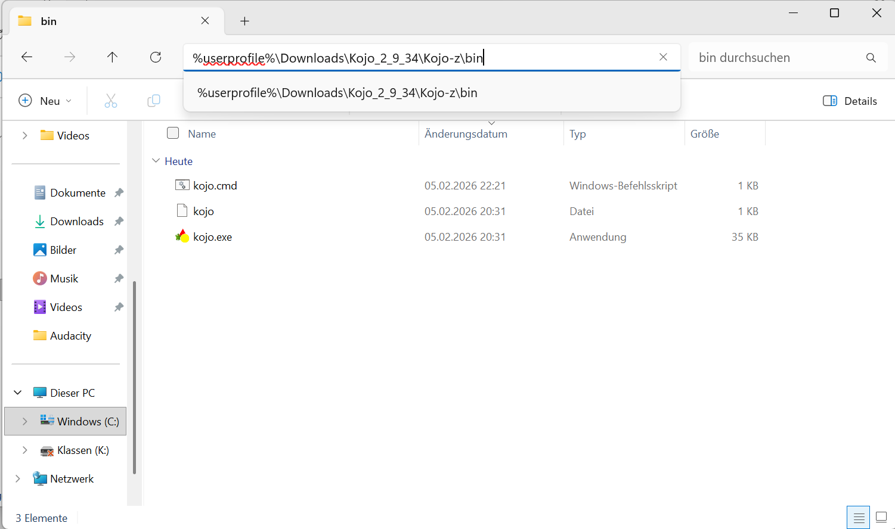
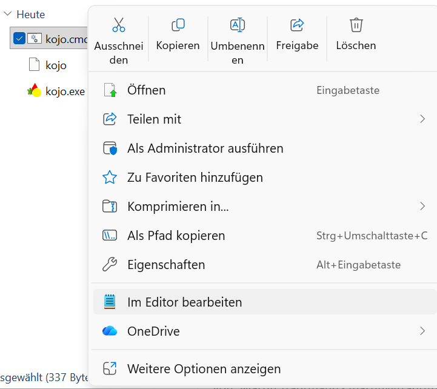
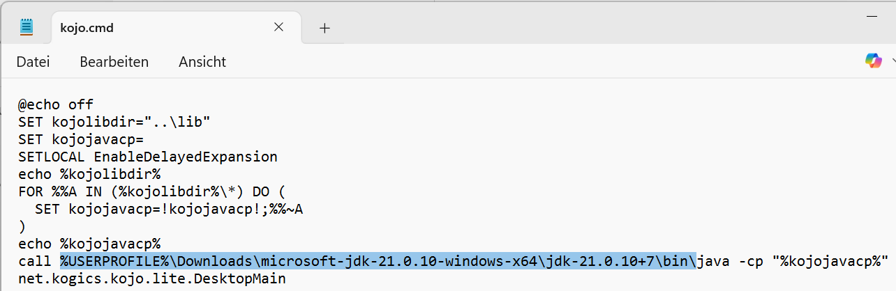
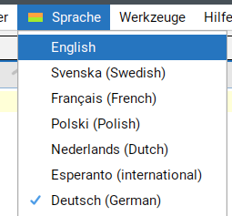
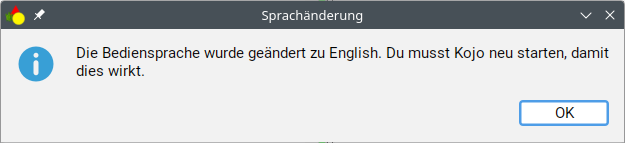

# 🐨 Kojo installieren auf Windows (ohne Admin-Rechte)

Hallo! 😊  
Hier lernst du Schritt für Schritt, wie du Kojo installierst.

---

# 📥 Schritt 1: Kojo herunterladen

Lade Kojo herunter:  
👉 [Kojo_2_9_34.zip](https://github.com/litan/kojo/releases/download/2.9.34_release/Kojo_2_9_34.zip)

Die Datei wird in deinem **Downloads-Ordner** gespeichert.

---

# ☕ Schritt 2: Java herunterladen

Kojo braucht Java. Lade es hier herunter:  
👉 [microsoft-jdk-21.0.10-windows-x64.zip](https://aka.ms/download-jdk/microsoft-jdk-21.0.10-windows-x64.zip)

Die Datei wird in deinem **Downloads-Ordner** gespeichert.

Wenn Du rechts oben auf den Pfeil nach unten klickst, sieht das so aus:

Wie im Bild dargestellt, gibt es ein Ordner-Symbol rechts von "Downloads" bei dem "Downloadordner öffnen" erscheint, 
wenn die Maus darüber ist. Damit bitte den Downloadordner öffnen.

---

# 📦 Schritt 3: Kojo ZIP entpacken

Rechtsklick auf **Kojo_2_9_34.zip**  
Dann klicke auf **Alle extrahieren…**

---

# ☕ Schritt 4: Java ZIP entpacken

Rechtsklick auf **microsoft-jdk-21.0.10-windows-x64.zip**  
Dann klicke auf **Alle extrahieren…**

---

# 📁 Schritt 5: Kojo-Ordner öffnen

Gehe in den Ordner:  
`%userprofile%\Downloads\Kojo_2_9_34\Kojo-z\bin`

So sieht der Ordner aus:

---

# 🛠 Schritt 6: kojo.cmd bearbeiten

Rechtsklick auf **kojo.cmd** → **Im Editor bearbeiten**

Dort steht eine Zeile die mit `call java` beginnt.  
Ersetze das `java` durch:

`%USERPROFILE%\Downloads\microsoft-jdk-21.0.10-windows-x64\jdk-21.0.10+7\bin\java`

So sieht das aus:

**Wichtig:** Speichere die Datei **kojo.cmd**, bevor du den Editor schliesst. Gehe dazu im Menü auf **Datei** → **Speichern**.

---

# ▶️ Schritt 7: Kojo starten

Doppelklicke auf **kojo.cmd** im selben Ordner. Kojo startet jetzt mit dem richtigen Java.

---

# 🌍 Schritt 8: Sprache auf Englisch umstellen (wichtig)

Damit alle im Kurs dieselben Menüs und Begriffe sehen, stellen wir Kojo **immer auf Englisch** um.

Klicke in Kojo auf: **Sprache → Englisch**

 

Danach musst du Kojo **selbst schliessen** und **neu starten**.

---

# 🔗 Schritt 9: Verknüpfung auf dem Desktop erstellen

Damit du Kojo schnell starten kannst, legst du eine Verknüpfung von **kojo.cmd** auf dem Desktop an.

1. Gehe in den Ordner:  
   `%userprofile%\Downloads\Kojo_2_9_34\Kojo-z\bin`
2. **Rechtsklick** auf **kojo.cmd**
3. Wähle **Senden an** → **Desktop (Verknüpfung erstellen)**

Die Verknüpfung erscheint auf deinem Desktop. Du kannst Kojo von dort aus starten.

---

# ✅ Fertig!

Jetzt kannst du mit Kojo programmieren! 🎉
